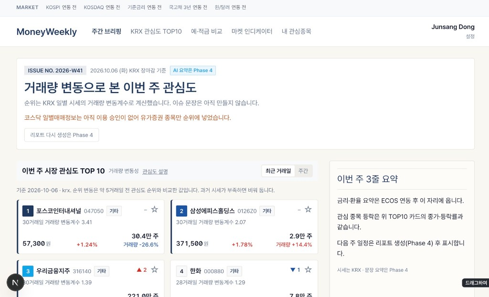
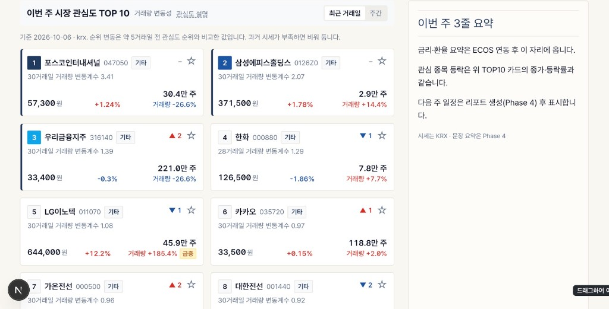

# 머니위클리 (MoneyWeekly)

한국 개인 재테크 이용자를 위한 주간 금융 브리핑 웹앱입니다. 거래량 변동성으로 본 유가증권 관심도 TOP10과 DART 공시를 한 화면에서 봅니다.





기준일은 2026-10-06 KRX 장마감입니다. 종가·등락률·거래량은 유가증권 일별매매정보로 계산했습니다.

## 이번 작업

- Next.js 15 App Router와 TypeScript, Tailwind로 앱을 구성했습니다.
- 로그인 전에도 관심도 TOP10 숫자를 미리 보고, Firebase Google 로그인 또는 로컬 목업 로그인 뒤 온보딩으로 들어갑니다.
- 관심 자산과 관심 종목은 서버에 저장하지 않고 브라우저 `localStorage`(`mw.assets`, `mw.tickers`)에만 둡니다.
- `GET /api/top10`이 시가총액 상위 100종목의 최근 30거래일 거래량 변동계수로 TOP10을 만듭니다.
- 승인된 KRX 서비스 두 가지를 연결했습니다.
  - 유가증권 일별매매정보: 순위, 종가, 등락률, 거래량
  - KRX 시리즈 일별시세정보: KRX 100, KRX 300, KRX 반도체
- TOP10 종목의 최근 7일 공시는 DART 오픈API로 가져오고, 제목은 DART 원문으로 연결합니다.
- 화면은 에디토리얼 캔버스(`#FAF7F2`)와 네이비(`#1E3A5F`)를 쓰고, 상승은 빨강, 하락은 파랑으로 표시합니다.

## 오류와 수정

| 증상 | 원인 | 수정 |
| --- | --- | --- |
| KRX 호출이 `401 Unauthorized` | 인증키만 있고 서비스별 이용신청이 승인 전이었음 | 승인 후 같은 키로 재호출. 실패 시 2026-10-06 목업 순위를 유지하고 이유를 화면에 표시 |
| 코스닥을 같이 부르면 순위 전체가 실패 | 코스닥 일별매매정보는 이번 승인 목록에 없음 | 코스닥 `401`은 건너뛰고 유가증권만으로 순위를 계산. 화면에 그 사실을 안내 |
| 삼성에피스홀딩스와 남광토건이 같은 `001260`으로 겹침 | 종목코드 `0126Z0`에서 숫자만 남겨 6자리로 자름 | `ISU_CD` 6자리를 문자 포함 그대로 사용 |
| 10월 7일 시세가 비어 있음 | KRX는 당일 시세를 바로 주지 않음 | 데이터가 있는 최근 영업일(2026-10-06)을 기준일로 사용 |
| 개발 서버가 `.env`의 `TOP10_SOURCE=krx`를 무시 | 셸에 남아 있던 `TOP10_SOURCE=mock`이 파일보다 우선 | 서버를 다시 띄울 때 기존 값을 제거하고 `.env`를 읽게 함 |
| 전일비 `+6.51%`가 `+6.5%`로 보임 | 소수 한 자리로 반올림 | 소수 둘째 자리까지 표시 |

## 로컬 실행

```bash
npm install
cp .env.local.example .env.local
npm run dev
```

브라우저에서 http://localhost:3000 을 엽니다. Firebase 웹 설정이 없으면 로그인 화면에 이유가 나오고, `NEXT_PUBLIC_AUTH_DEV_BYPASS=true`일 때만 로컬 목업 로그인을 허용합니다.

키 이름은 `.env.local.example`에 있습니다. `.env`와 `.env.local`은 저장소에 올리지 않습니다.

`TOP10_SOURCE=mock`이면 명세의 2026-10-06 목업 10종목을 보여주고, `krx`이면 위 실데이터를 사용합니다.

## 배포

GitHub 저장소는 [junsang-dong/goorm-261007-money-weekly](https://github.com/junsang-dong/goorm-261007-money-weekly) 입니다. Vercel에서는 `NEXT_PUBLIC_FIREBASE_*`, `KRX_AUTH_KEY`, `DART_API_KEY`, `TOP10_SOURCE=krx`를 프로젝트 환경변수로 넣어야 로그인과 시세가 로컬과 같이 동작합니다.
